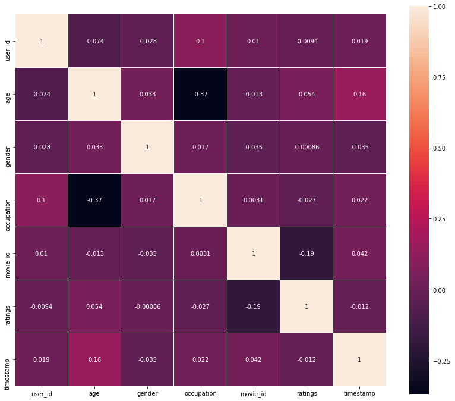
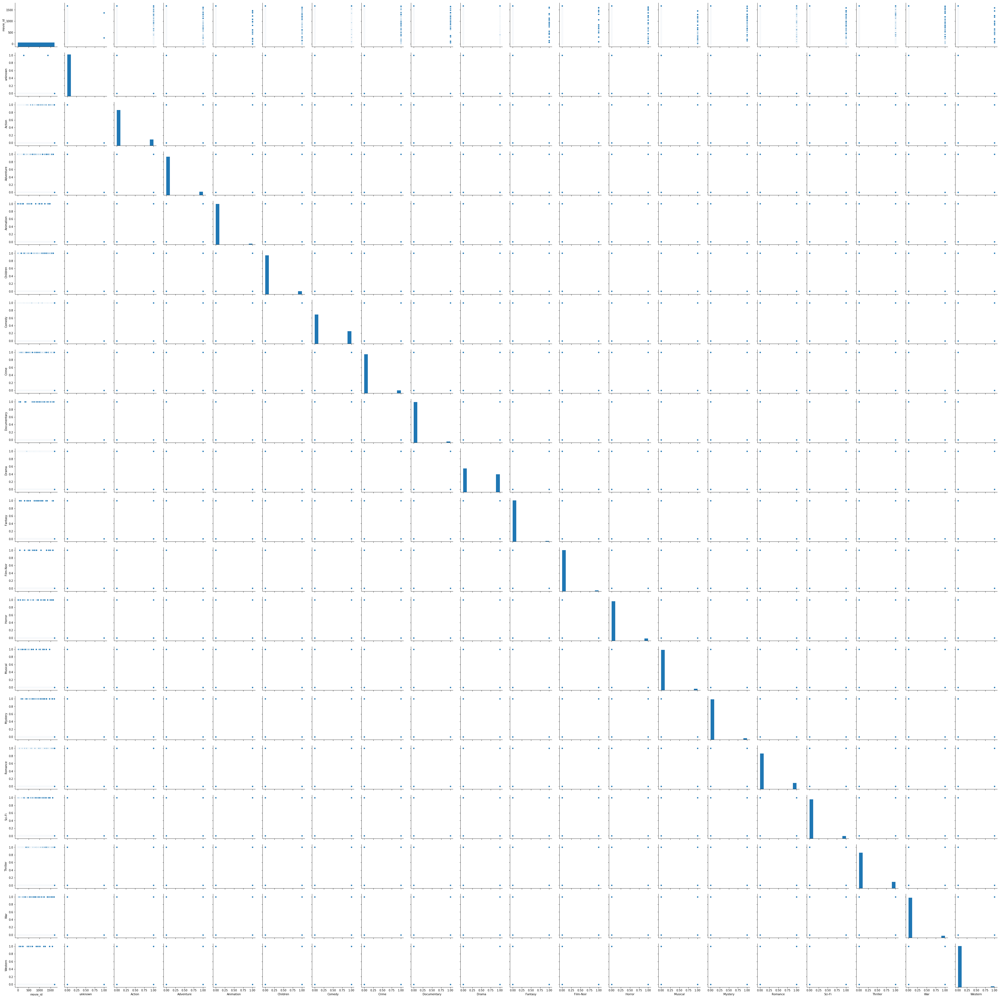
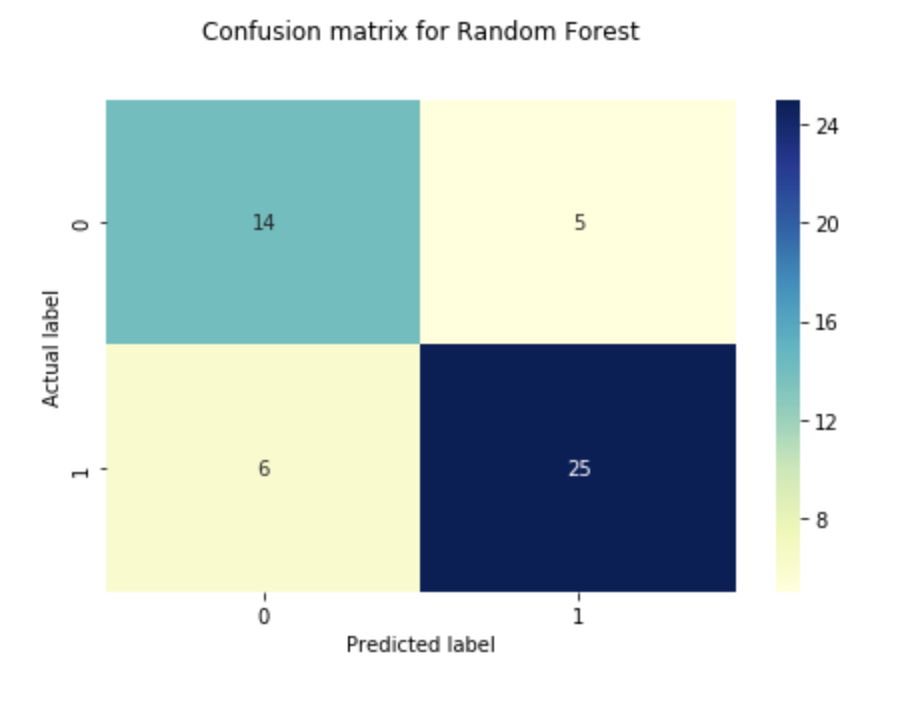
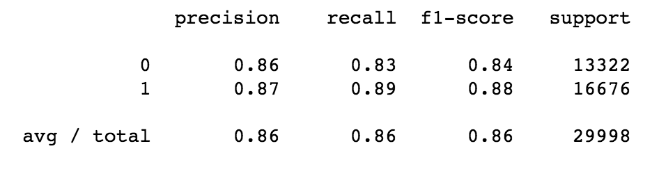
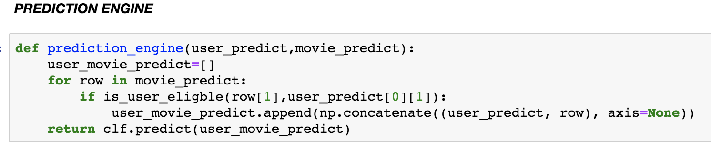
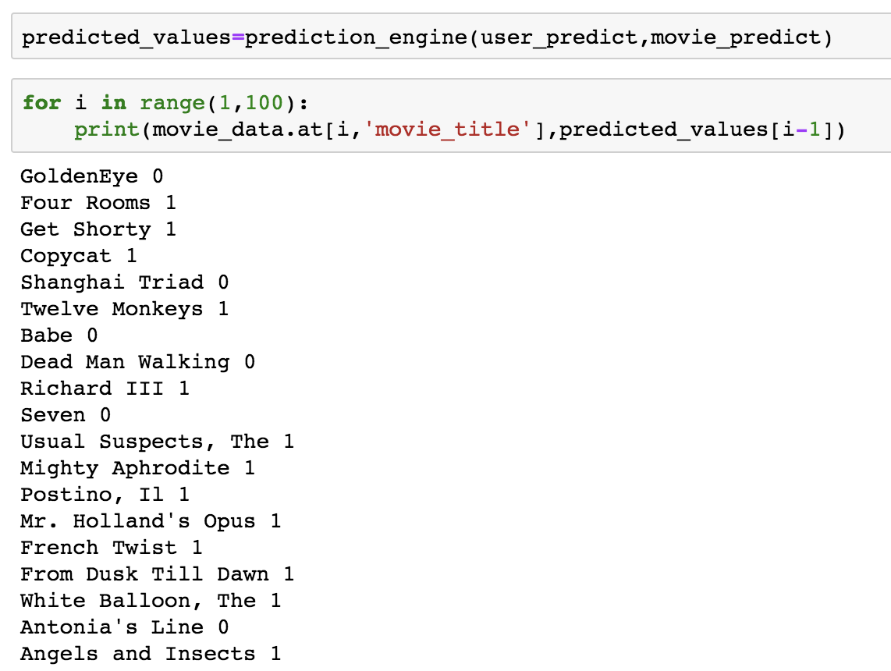

# Movie Recommendation Engine

Predictive engine for recommending movies to users based on user's profile and user's historical movie ratings.

## Data Used

[Movie Lense 100k](https://grouplens.org/datasets/movielens/100k/)

We are using MovieLens datasets for our research and learning purpose. MovieLens dataset were collected by the GroupLens Research Project at the University of Minnesota. Its has a wide variety of data ranging from 100k, 1m to 10m. For our project, we have picked ml100k movie dataset. Following are the subsets we used for our model creation, 
 
 ```
 * u.data: 100000 ratings by 943 users on 1682 items - user id | item id | rating | timestamp 
 * u.item: List of the movies - movie id | movie title | release date | video release date |IMDb URL | unknown | Action | Adventure | Animation |Children's | Comedy | Crime | Documentary | Drama | Fantasy |Film-Noir | Horror | Musical | Mystery | Romance | Sci-Fi |Thriller | War | Western |
 * u.genre: List of the genres
 * u.user: Demographic information about the users - user id | age | gender | occupation | zip code
 * u.occupation: List of the occupations
 ```
 
 ## Data Visualization 
  1. Visualized the data using a heap map of all user profile attributes and ratings given by user with all movie ids
  &nbsp;
  
  
     
     ```
                                       Fig 1: Heat Map
      ```                 
   &nbsp;
   2. Drew pairplot to identify pairwise relationships among all the movie attributes in the dataset<br>
   &nbsp;
   
   
   
   ```
                                       Fig 2: PairPlot
   ```
   

## Data Enrichment
#### First data enrichment 
1. TMDB dataset ( https://www.kaggle.com/tmdb/tmdb-movie-metadata )
2. Used in Linear regression problem 
#### Second data enrichment
1. For recommending appropriate movies to the user while considering their age, we scrapped content rating from IMDB dataset.
2. The script for fetching the data through api and merging the datasets is in DataEnrichment file.

## Latent variables 
```
 Latent variables are ‘Movie_year’, ‘Movie_decade’ and ‘Liked’
```
## Latent Manifold Identification  
#### 1. Movie_year: 
 Fetching movie year from the movie release date 
#### 2. Movie_decade: 
Bucketing the movie year into a span of 10 years
#### 3. Liked: 
Created a new binary variable derived from movie ratings. Movie ratings vary from 1 to 5, Liked variable is 1 if user has give more that 3 rating to any movie, else liked variable is 0.

## Algorithms Used
 ### K-means
   Detailed interpretation and analysis can be seen here - <br> https://github.com/cpati/machine-learning-movies/tree/master/kmeans
 ### GMM
   Detailed interpretation and analysis can be seen here - <br> https://github.com/cpati/machine-learning-movies/tree/master/gmm
 ### Decision Tree
  * The accuracy of the model with maximum depth as 5 was observed ~60%. Since the bias decreases and variance increases with the increasing depth of the decision tree. <br>We observed the best result were seen at maximum depth = 12 with ~63% accuracy in the prediction.
  ```
  Decision Tree Classifier Accuracy score: 0.6355 or 63%
  ```
 ### Logistic Regression
 * The objective behind using logistic regression was to find the likelihood between the user profile attributes and ratings. The algorithm was first applied on multiclass classification with 24 features. The prediction accuracy was 34%. Later we introduced, latent variables and classified features into binary values which raised the accuracy.
 ```
 Logistic Regression Accuracy score: 0.574 or 57%
 ```
 ### Support Vector Machine
  * Algorithm ran for ~15 minutes and didn’t complete. Kernel died because of the huge dataset. Python crashes with 16gb ram during this implementation with just 100000. Not a good model.
 ### Naive Bayes
 * The goal was to predict if the user will like the movie or not based on the user profile and historical ratings. To check every attributes contribution like age, gender, occupation, movie_year, content rating and all genres we implement Naive  Bayes. The accuracy was very low ~29% hence, we created a function and applied binary classification on ratings where 1 to 3 mapped to 0 and above to 1. This value was stored in variable “liked”. Now, classification based on the user’s attributes with “liked” latent variable increased the accuracy.
 ```
 Naive Bayes Accuracy score: 0.563 or 56%
 ```
 ### Random Forest
 * Random Forest is a supervised learning algorithm. It is an ensemble learning method for classification and worked best for our use case. The algorithm overrides the limitation of decision tree where variance increases with the depth of the tree. Random forest reduces variance by aggregating the ensemble of various smaller trees also called forests.
 ```
 Random Forest Accuracy score: 0.863 or 86%
 ```
 &nbsp;
 &nbsp;
 ## Metrics for measuring model performance 
 ### 1. Confusion Matrix
 &nbsp;
 &nbsp;
 
 ```
                                  Fig 3: Confusion Matrix
 ```
 &nbsp;
 ### 2. Random Forest R^2 value: 0.447
 ### 3. Classification Report
 &nbsp;
 &nbsp;
 
 ```
                                  Fig 4: Classification Report
 ```
 &nbsp;
 
 ## Conclusion
 The prediction engine that uses Random Forrest model will run for all users periodically to recommend movies they may like based on their user profile and prior likeness.
 &nbsp;<br><br>
 Below is the snippet of how prediction engine was implemented,<br>
  &nbsp;
  &nbsp;
 
 ```
 The engine uses Random Forest algorithm to predict movies for the users which they may like.
 ```
 &nbsp;
 &nbsp;
 Movies predicted for user x is represented as follows,
   &nbsp;
   &nbsp;
 
 ```
 Sample output of the model where the binary value 0 in front of movie name means it is not recommended to the user and the binary value 1 in front of the movie name is recommended by the model.
 ```
 &nbsp;
 
 ## Individual Contributions 
 <br>
 
|    Names          | Contributions                 | 
| ----------------- |:-----------------------------:| 
| Vidhi Sharma      | Data Cleaning, Data enrichment, GMM, Linear Regression, SVM | 
| Himangini Agrawal | K-means, Random Forest, Naive Bayes, PCA      |  
| Chidananda Pati   | Prediction Engine, Decision Tree, Logistic Regression, Latent Manifold      |   

&nbsp;
#### Most of the movie recommendation models follow collaborative filtering. An analysis of user-user based collaborative filtering and item-item based collaborative filtering uploaded as a separate notebook. 
 
