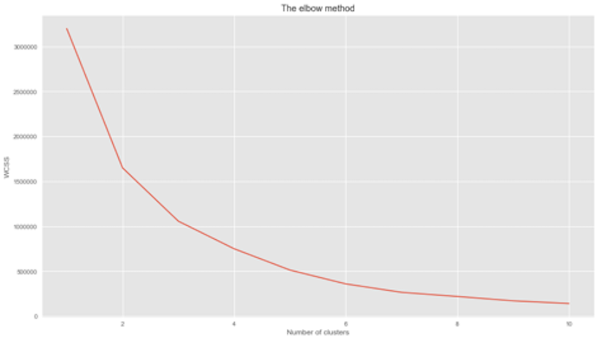
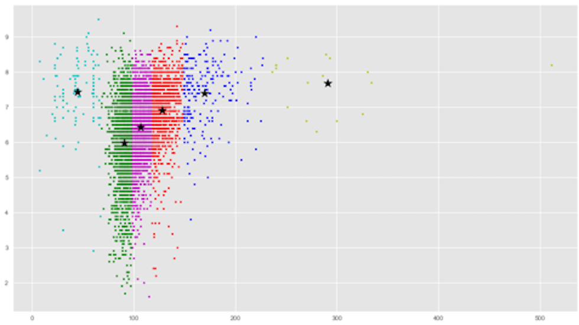

## Dataset 
IMDB Movie Dataset. This dataset is generated from IMDb data. The dataset is released under Open Database License and has rights to use granted under some conditions. The dataset is enriched with various details of 5000 different language movies and can be used for practical business scenarios. 
  The link of the dataset is here - (https://www.kaggle.com/carolzhangdc/imdb-5000-movie-dataset).

## Objective 
Recommend high rated movies to the user based on their leisure schedule.

## Algorithm 
### Gaussian Mixure Model Clustering 
  1. Read the csv file into a dataframe.
  2. As part of data preparation, cleaned the null values from rows with duration or imdb_score as blank.
  3. Plot the values using Akaike information criterion (AIC) and the Bayesian information criterion (BIC)  
  

  	Fig 1: AIC/BIC method 
  4. Used the value of k as 6 from the above graph.

  5. Used sklearn to implement Gaussian Mixture Model
  
  

   	Fig 2: GMM clusters

  6. Compare and contrast with K-means.
  
 | K-means Cluster             				    |  GMM Cluster		|
|:---------------------------------------------------------:|:-------------------------:|
|  			    |  |

 
		Fig 3: elbow method					Fig 4: BIC method

|K-means Cluster             				    |  GMM Cluster		|
|:---------------------------------------------------------:|:-------------------------:|
|  				    |  	|

		Fig 5: K-means						Fig 6: GMM 

    
    
As shown in the above pictures K-means clustering is giving hard distinction between the clusters while in GMM there are some outliers which are difficult to infer (purple dots below the green cluster). Green cluster in GMM symbolise that the movies that have low duration, Purple clusters symbolise the movies with high duration and high rated movies but there is purple dots below green clusters puts an ambiguity to the inference.   

## Conclusion 
K-means clustering is a better algorithm for our scenario. We have a flat dataset with two clear dimensions of movie duration and imdb_score where, duration of the movie is x-axis and imdb_score is y-axis. Since gmm does not hard assign the data points to a cluster unlike k-means, we saw uncertainty in understanding of data points. Gmm gave a result which is difficult to interpret whereas, hard assignment in k-means was easy to interpret and implement.

## New Insights 
The current features used in clustering helped us to understand our dataset but we also got to know that to build a prediction model we require user data. On the basis of user’s choice we can recommend the movies from the clusters we formed in this part of assignment.
				
### Individual Contributions 

|    Names          | Contributions                 | 
| ----------------- |:-----------------------------:| 
| Vidhi Sharma      | Data Preparation/data munging | 
| Himangini Agrawal | BIC/AIC to find number of clusters      |  
| Chidananda Pati   | GMM algorithm implementation      |   

